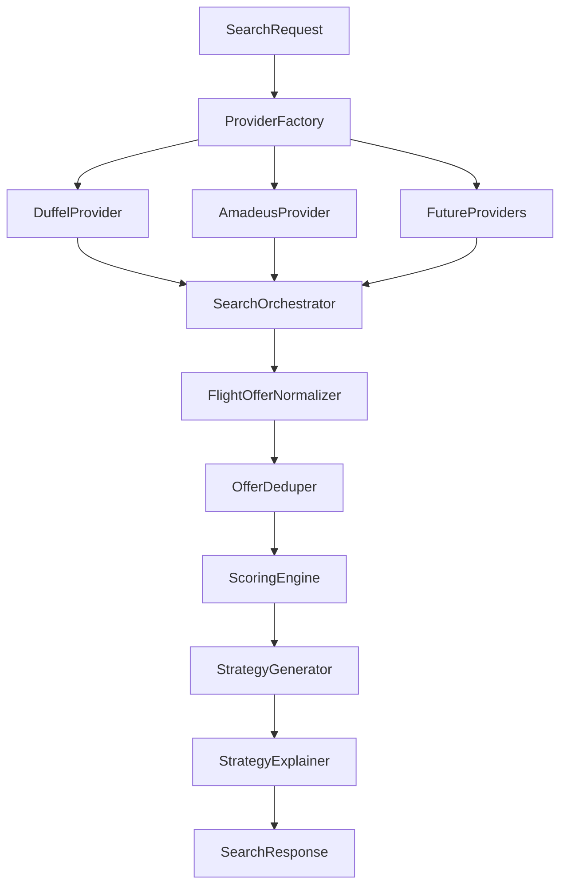

# Multi-Provider Architecture

## Objetivo

Permitir que `Viagest Scout` consulte varios proveedores de vuelos sin acoplar el motor de estrategia a una sola fuente.

La idea central es separar:

- inventario externo
- normalizacion interna
- scoring y estrategia
- observabilidad por proveedor

## Componentes actuales

### Registro de proveedores

- `backend/app/services/providers/registry.py`
- `backend/app/services/providers/factory.py`

El registro construye providers por nombre y el factory permite:

- `get_flight_provider()` para un proveedor puntual
- `get_flight_providers()` para una lista de proveedores configurados

### Adaptadores de proveedores

- `backend/app/services/providers/duffel.py`
- `backend/app/services/providers/amadeus.py`
- `backend/app/services/providers/demo.py`

Cada adaptador convierte la API externa a una forma intermedia compatible con el normalizador.

### Orquestacion

- `backend/app/services/orchestrator.py`

Responsabilidades:

- lanzar búsquedas en paralelo
- capturar errores por proveedor
- consolidar ofertas exitosas
- registrar supuestos y fallas parciales
- pasar el resultado unificado al motor de estrategia

### Normalizacion

- `backend/app/services/normalizer.py`

Toma las ofertas crudas de cualquier provider y las transforma en `ItineraryOption`.

### Dedupe

- `backend/app/services/offer_deduper.py`

Elimina ofertas equivalentes usando una firma basada en:

- ruta
- escalas
- ventana temporal
- aerolineas

Si dos ofertas compiten, prioriza:

1. menor precio
2. menor duracion
3. prioridad de proveedor configurada

## Flujo de datos



## Configuracion

### Single-provider

```env
FLIGHT_PROVIDER=duffel
FLIGHT_PROVIDERS=duffel
```

### Multi-provider

```env
FLIGHT_PROVIDER=duffel
FLIGHT_PROVIDERS=duffel,amadeus
```

`FLIGHT_PROVIDER` queda como default/fallback de configuracion.
`FLIGHT_PROVIDERS` define la lista efectiva de providers a consultar.

## Regla importante

No existe fallback silencioso a `demo`.

Si un provider real falla:

- y otro responde: la búsqueda sigue con resultados parciales
- y todos fallan: el backend devuelve error explícito

## Como agregar un nuevo proveedor

### 1. Crear adaptador

Agregar archivo nuevo:

- `backend/app/services/providers/<nuevo>.py`

Debe implementar `BaseFlightProvider`.

### 2. Registrar proveedor

Actualizar:

- `backend/app/services/providers/registry.py`

### 3. Mapear payload externo

El adaptador debe devolver una forma compatible con el normalizador actual:

- `id`
- `offer_code`
- `provider_name`
- `title`
- `total_price`
- `currency`
- `baggage_included`
- `flexibility_label`
- `self_transfer`
- `segments`
- `cash_miles_hint`

### 4. Validar dedupe

Si el nuevo proveedor trae inventario muy parecido a otro, revisar si la firma de `OfferDeduper` necesita más campos.

### 5. Medir

Agregar al menos:

- latencia
- tasa de error
- cantidad de ofertas
- mercados donde aporta cobertura

## Siguientes mejoras recomendadas

### Health por proveedor

Crear un `provider_health.py` para registrar:

- errores por provider
- tiempo medio
- ultima respuesta valida
- cantidad de ofertas por búsqueda

### Timeout por proveedor

Ya existe configuracion por proveedor via:

```env
PROVIDER_TIMEOUTS=duffel:30,amadeus:25,demo:5
```

Tambien se puede expresar como JSON:

```env
PROVIDER_TIMEOUTS={"duffel":30,"amadeus":25}
```

Si un provider no tiene timeout configurado, el backend usa `20s` como valor por defecto.

### Weighting por fuente

En una fase posterior se puede sumar un score extra por calidad de fuente:

- cobertura
- estabilidad
- frescura
- completitud de equipaje y reglas

### Persistencia del origen

Hoy cada `ItineraryOption` ya conserva `provider_name`.
Luego se puede persistir metadata adicional:

- request id externo
- raw carrier owner
- timestamp de consulta por provider

## Decisiones ya tomadas

- multi-provider en paralelo
- dedupe antes del scoring
- sin fallback silencioso a demo
- error parcial visible como supuesto de provider
- arquitectura abierta para sumar nuevas fuentes
